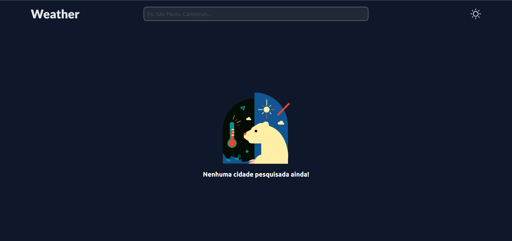
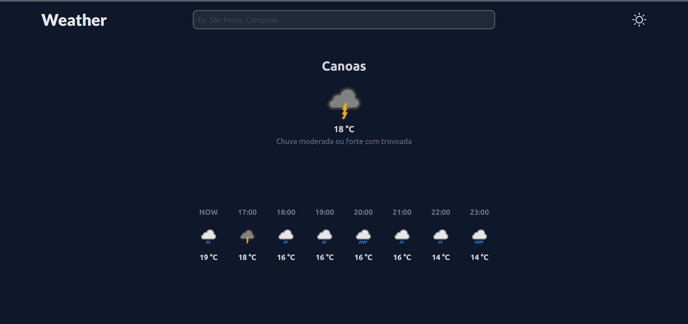
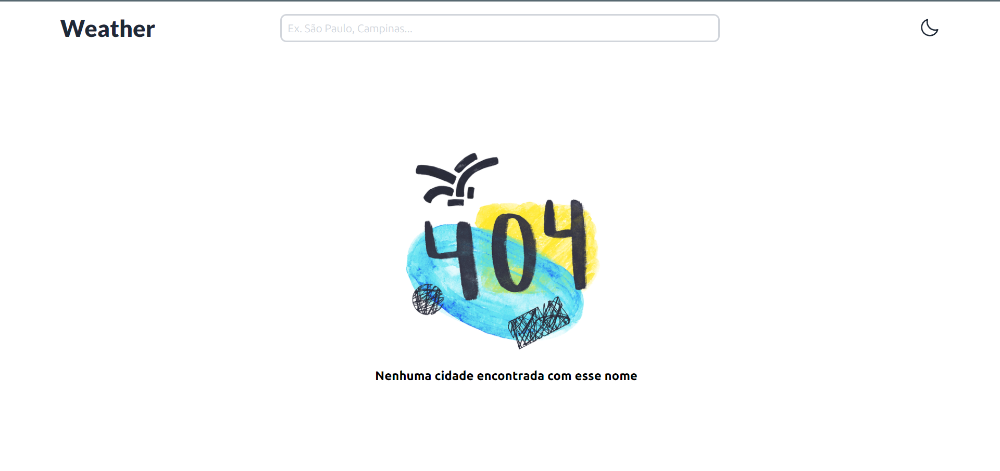

# Weather App

## Overview

The Weather App is a web application that allows users to check the weather in any city of their choice. It is built using React.js, TypeScript, and Next.js, and it utilizes a Weather API to provide up-to-date weather information.

### Any city founded



### City searched



### Any city founded



## Technology

Here are the technologies used in this project.

- React.js
- TypeScript
- Next.js

## Features

- **City Search:** Users can enter the name of a city or location to get the current weather conditions.

## Installation

To run the Weather App locally follow these steps:

1. Clone this repository to your local machine.

   ```bash
   git clone https://github.com/diuliano-vargas-silveira/weather-app
   ```

2. Navigate to the project directory.

   ```bash
   cd weather-app
   ```

3. Install dependencies using npm

   ```bash
   npm install
   ```

4. Set up the Weather API credentials. You may need to obtain an API key from a Weather API provider and url.

- Create a .env.local file in the project root.

  ```env
    API_KEY=your-api-key
    DEFAULT_API_URL=http://api.weatherapi.com/v1/
  ```

## Usage

1. On the homepage, you will see a search bar.

2. Enter the name of the city or location for which you want to check the weather.

3. Press the "Search" button or hit Enter.

4. The app will fetch and display the current weather conditions for the specified location.

## Acknowledgments

- The Weather App was built using various open-source libraries and resources. We would like to thank the open-source community for their contributions.

- Weather data is provided by [Weather API](https://www.weatherapi.com/).

## Contact

If you have any questions or feedback, please feel free to contact us at [diulianovargas@gmail.com](diulianovargas@gmail.com).

Happy weather checking!
